# dmarc-agent

<div align="center">
  
</div>

<p align="center">
  
  
  
</p>

CLI tool and SaaS wrapper for auditing and enforcing email authentication — SPF, DKIM, and DMARC — built with FastAPI and a static HTML/Tailwind frontend.

## Project Structure

```text
backend/
  main.py
  scanner.py
  emailer.py
  models.py
  requirements.txt
  .env.example
frontend/
  index.html
  results.html
  assets/
    style.css
    app.js
requirements.txt
README.md
```

## Local Development

1. Create and activate a virtual environment.
```bash
python3 -m venv .venv
source .venv/bin/activate
```

2. Install dependencies.
```bash
pip install -r requirements.txt
```

3. Configure environment variables.
```bash
cp backend/.env.example .env
# then edit .env
```

4. Run the backend.
```bash
uvicorn backend.main:app --reload
```

5. Open the app.
- Landing page: `http://127.0.0.1:8000/`
- Results page: `http://127.0.0.1:8000/results.html?scan_id=<id>`
- Health: `http://127.0.0.1:8000/health`

## Environment Variables

| Variable | Description |
|----------|-------------|
| `RESEND_API_KEY` | Resend email API key |
| `FROM_EMAIL` | Sender address for reports |
| `SCAN_CACHE_TTL_SECONDS` | Cache TTL (default: `3600`) |
| `ALLOWED_ORIGINS` | CORS origins (comma-separated, `*` for dev) |

## API Endpoints

| Endpoint | Description |
|----------|-------------|
| `POST /api/scan` | Initiate a domain scan |
| `GET /api/scan/{scan_id}` | Fetch scan results |
| `POST /api/scan/{scan_id}/report` | Email the report |
| `GET /health` | Health check |

## Railway Deployment

1. Push this repo to GitHub.
2. In Railway, create a new project from the repo.
3. Start command (or `Procfile`):
```bash
uvicorn backend.main:app --host 0.0.0.0 --port $PORT
```
4. Add environment variables from `backend/.env.example`.
5. Deploy and test `/health` then `/api/scan`.

## Notes

- In-memory scan cache only — no database required for MVP.
- `dmarc_agent` source is vendored in `dmarc_agent_src/` for deploy portability.
- No auth in this version; add API key middleware before exposing publicly.

## Author

**Daniel Gregg Jr**
- Portfolio: [daniel-eportfolio.web.app](https://daniel-eportfolio.web.app)
- LinkedIn: [linkedin.com/in/daniel-sin-1881ske89](https://linkedin.com/in/daniel-sin-1881ske89)
